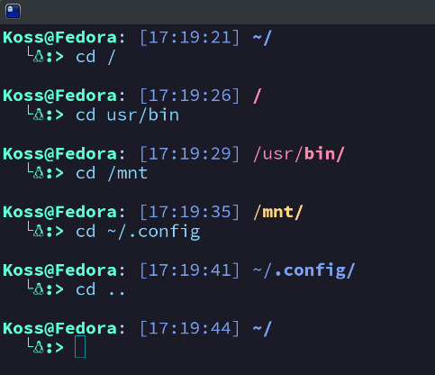
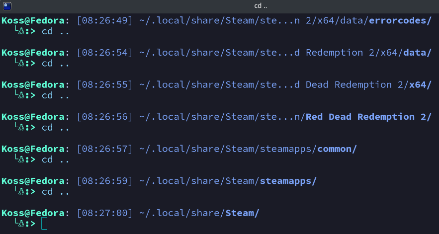
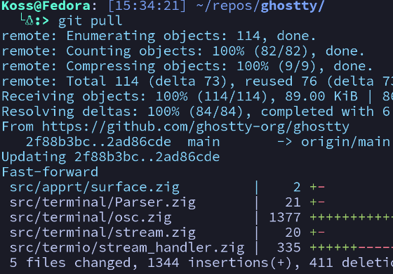
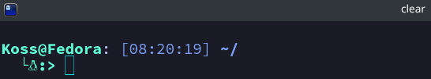

# tokyobash
A custom bash prompt inspired by the [Tokyo Night Theme](https://www.github.com/folke/tokyonight.nvim) for [Neovim](https://www.github.com/neovim/neovim).
## Features
Will highlight the current directory and change color depending if you're in HOME/ root/ or /mnt.



And will abbreviate paths longer than 50 characters.




## Installation
You will need a c compiler.
Either gcc or clang should be fine.

And add this to your .bashrc or .bash_profile:

```bash
SECONDS=0
export PROMPT_COMMAND='PS1="$(path/to/tokyobash/binary $SECONDS)"'
```
Then replace 'path/to/tokyobash/binary' above with the acutal path to the compiled tokyobash.c binary.

Save then restart your terminal!
## Known Issues
If another program, like git, alters the font color it will be reset back to default until the next prompt prints.


##
After a 'clear', your prompt will be at the top, but with a blank line above.


## Disclaimer
I'm not sure if this will run on all linux distros. I'm also new to programming so any feedback is welcomed.

All screenshots were taken in ghostty terminal with tokyonight theme.
